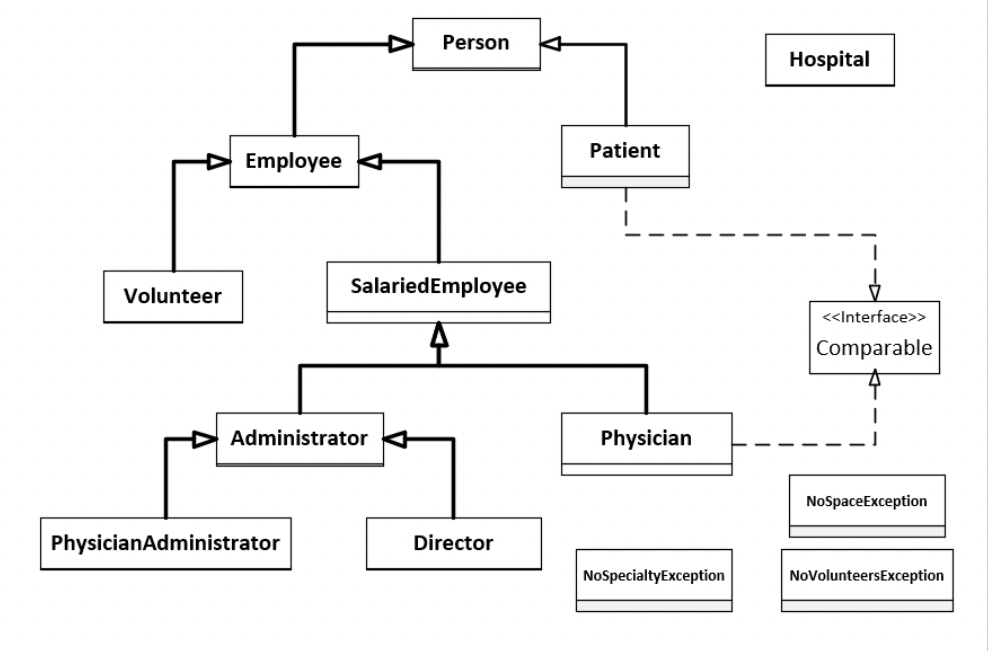

# Hospital Management System

The Problem is defined in the document below.

## UML Diagram

## Problem Description
General information and Configuration about the Virtual Hospital:
• A Hospital has a team of Physicians, Administrators, Volunteer workers.
• A Hospital admits and provides treatment for Patients.
• A volunteer who works in the hospital is considered an employee, but volunteers are
not paid for their work.
• The hospital stores the following information about any volunteer: First name, Last
name, Age, Gender, Employee ID, and Address
• The hospital stores the following information about any employee, physician or
administrator, First Name, Last name, Age, Gender, Employee ID, Address and Salary.
• The hospital assigns a unique employee ID to each physician, administrator or
volunteer worker starting from 100.
• The hospital stores the following information about any patient: First Name, Last
name, Age, Gender, Patient ID and Address.
• The hospital assigns a unique Patient ID to each patient starting from 1000.
• The hospital is not allowed to have duplicate patient records.
• A Patient has a designated Physician assigned.
• A Physician can have several Patients assigned at the same time.
• Any volunteer worked in the hospital can be assigned to any physician.
• There are two types of administrator roles: director and physician administrator.
• There is only one director for the hospital. The director manages all the physician
administrators.
• There are three types of physician specialties in the hospital: Immunology,
Dermatology, and Neurology.
• The number of physician administrators in the hospital is equal to the number of
specialties, and a physician administrator manages only physicians with the same
specialty.
It is essential to know that the hospital has the following restrictions:
• Number of Directors: 1
• Number of Physician Administrators: 3
• Number of Physicians assigned to a Physician Administrator: Up to a maximum of 25
• Number of Physicians: Up to a Maximum of 70
• Number of Volunteers: Up to a Maximum of 150
• Number of Patients: Up to a Maximum of 500
• Number of Volunteers assigned to a Physician: Up to a maximum of 5
• Number of Patients assigned to a Physician: Up to a maximum of 8
• Read the problem description and check the Junit test cases to identify all the implicit
and explicit entities stated in the scenario and design a suitable class hierarchy for the
virtual hospital. Add appropriate constructors, accessor/getter, mutator/setter
methods to provide basic functionality to the classes. Also, appropriately redefine
equals and toString methods while using the class attributes.
Task2:
Implement following operations relevant to the appropriate classes you have defined.
• AdmitPatient: when the hospital admits a new patient
a. You need to add the patient information to the hospital patient record
b. You need to assign a physician to every newly admitted patient, and then
the patient will be added to the corresponding physician record.
c. The patients are assigned to physicians on a first-come-first-serve basis.
d. The hospital should not admit the same patient twice (i.e., no duplicate
patient in the hospital patient record)
• DischargePatient: when the hospital discharges a patient (patient discharged from the
hospital when patient treatment is completed), you need to clear/remove the patient
information from the hospital patient record.
• HireVolunteer: when the hospital hires a new volunteer, you need to store volunteer
information in the hospital volunteer record and then assign the volunteer to a
physician who has not exceeded the volunteer limit yet.
a. The hospital cannot hire the same volunteer twice. Hence, there is no
duplicate.
b. The volunteers are assigned to physicians on a first-come-first-serve basis.
• ResignVolunteer: when a volunteer is resigning from the hospital, you need to
clear/remove the volunteer information from the hospital volunteer record.
• ExtractAllPatientsDetails: you need to extract and return all the patient information
stored in the hospital patient record as a sorted list of patients according to the
patient's full name.
a. The patient's full name is defined as a concatenation of first name and last
name as follows: if a patient's first name is "Mark" and the last name is
"Smith", the patient's full name is "Mark, Smith".
• ExtractAllPhysicianDetails: you need to extract and return all the physician information
stored in the hospital physician record as a sorted list of physicians according to the
physician's full name.
a. The physician's full name is defined as a concatenation of first name and last
name as follows: if a physician's first name is "Chris" and the last name is
"Johnny", the physician's full name is "Chris, Johnny".
• ExtractAllVolunteersDetails: you need to extract and return all the volunteer
information stored in the hospital volunteer record as a list of volunteers.
• ExtractPatientDetails: you need to extract and return all the patient information
assigned to a particular physician as a sorted list of patients according to the patient's
full name.
a. The patient's full name is defined as a concatenation of first name and last
name as follows: if a patient's first name is "Mark" and the last name is
"Smith", the patient's full name is "Mark, Smith".
• ExtractVolunteerDetails: you need to extract and return all the volunteer information
assigned to a particular physician as a list of volunteers
• ExtractPhysician: you need to extract and return all the physician information
belonging to a particular specialty as a sorted list of physicians according to the
physician's full name.
a. The physician's full name is defined as a concatenation of first name and last
name as follows: if a physician's first name is "Chris" and the last name is
"Johnny", the physician's full name is "Chris, Johnny".
• HirePhysician: when the hospital hires a new physician
a. You need to add the physician information to the hospital physician record.
b. The newly hired physician is assigned to the designated physician
administrator, and then the physician will be added to the corresponding
physician administrator record with the same specialty.
c. The hospital cannot hire the same physician twice. Hence, there is no
duplicate.
• ResignPhysician: when a physician is resigning from the hospital
a. You need to remove the Physician information from the hospital physician
record.
b. The designated physician administrator will assign the patients of the
resigned physician to the next available physician (or physicians).
c. Reassign the volunteers for the next available physician (or physicians).
d. When reassigning patients and volunteers, there can be a scenario where all
the physicians in the hospital are not available to handle the remaining
patients, or no volunteers are needed. At this point, ignore these specific
cases and implement this operation, assuming these steps can be achieved
successfully.
